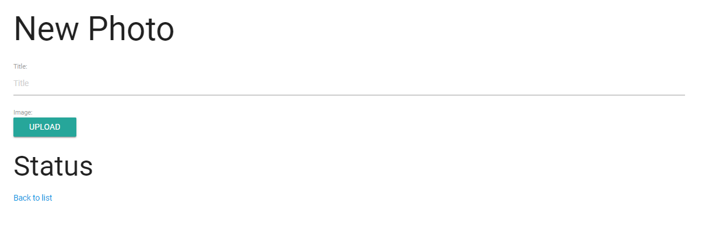

# Angular 4 + Cloudinary Image Integration

## Running it

Make sure to have Node.JS installed in your system with NPM.

 1) Grab the dependencies with npm:

    `npm install`

    ## Development server

Run `ng serve` for a dev server. Navigate to `http://localhost:4200/`. The app will automatically reload if you change any of the source files.

## Code scaffolding

Run `ng generate component component-name` to generate a new component. You can also use `ng generate directive|pipe|service|class|module`.

## Further help

To get more help on the Angular CLI use `ng help` or go check out the [Angular CLI README](https://github.com/angular/angular-cli/blob/master/README.md).

### Legacy Dependencies :

1) Angular 4
2) Cloudinary Account Needed

### History Snapshot:

